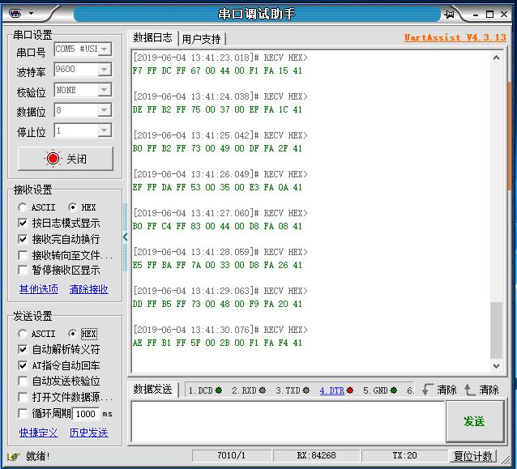

# Accelerometer and Gyroscope 测试

## 使用说明
1. uart连接Arduino Interface的3和4引脚。

2. 下载FPGA bitstream

   Vivado > Open Hardware Manager > Open target > Auto Connect > Program device > Select system_wrapper.bit in Bitstream file > Program

## 测试结果

1. 波特率为9600，无校验位，数据位为8；

2. 接受窗口共12组十六进制数，前6组为陀螺仪，后6组为加速度计，其含义分别为：陀螺仪x轴低8位、陀螺仪x轴高8位、陀螺仪y轴低8位、陀螺仪y轴高8位、陀螺仪z轴低8位、陀螺仪z轴高8位、加速度x轴低8位、加速度x轴高8位、加速度y轴低8位、加速度y轴高8位、加速度z轴低8位、加速度z轴高8位；

3. 静止时，高8位基本不变，低8位有值变化；移动时，所有数据都有变化。