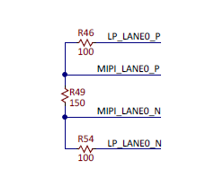
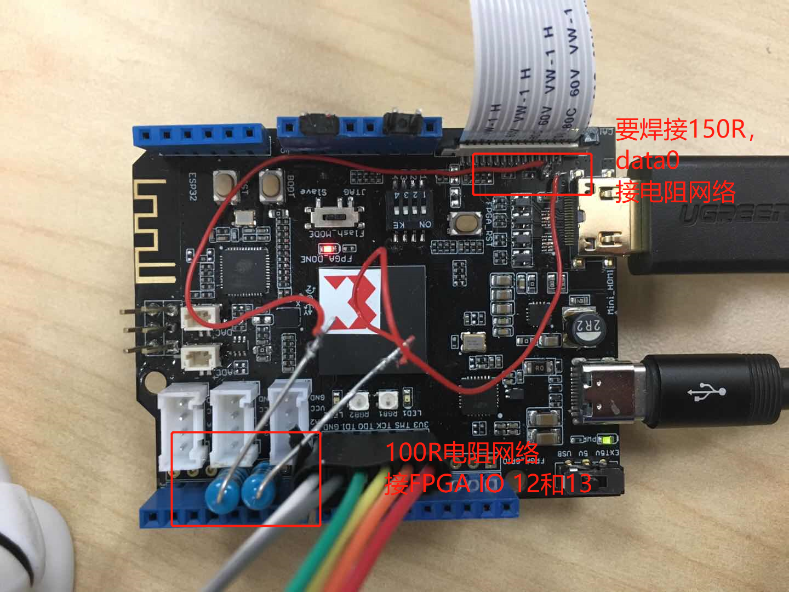

# 硬件修改
## MIPI摄像头硬件修改
参考Zybo及Zynqberry设计，需要增加数据通道DATA0的LP引脚，

将引脚接到data_lp_n_0接到FPGA_IO12、data_lp_p_0接到FPGA_IO13

## 详细修改内容

**FPGA_CAM_DN0--100欧电阻--FPGA_IO_12**

**FPGA_CAM_DP0--100欧电阻--FPGA_IO_13**

**差分线间电阻R98、R99、R100也需焊接150R电阻**

**FPC座子不要焊反**

当前飞线如下图所示

## HDMI修改

HDMI封装错误，需要重新设计