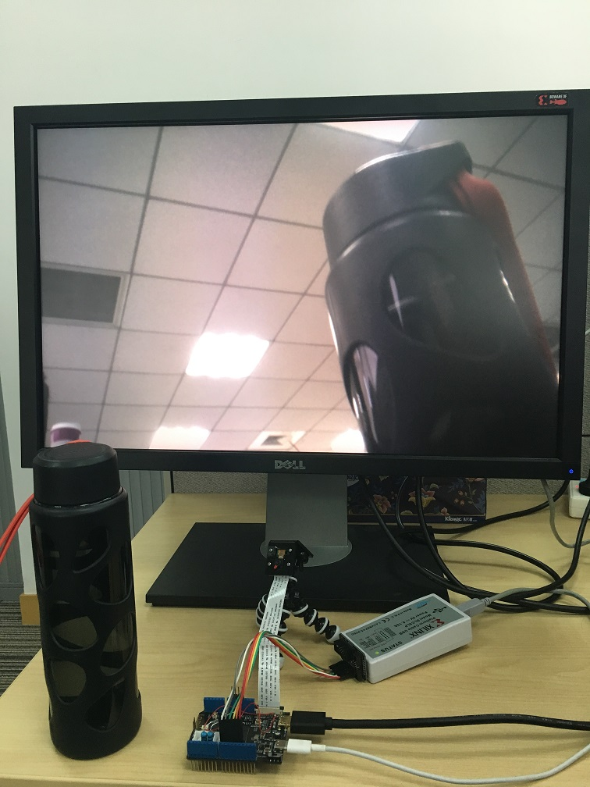

# MIPI Camera测试

## 硬件描述
1. 摄像头型号：Raspberry Pi Camera Rev 1.3
2. CMOS型号：OV5647
3. 显示格式：720p(1280x720)@30/60hz、RGB输出

## 使用说明
Vivado > Open Hardware Manager > Open target > Auto Connect > Program device > Select mipi_camera.bit in Bitstream file > Program

## 测试结果
